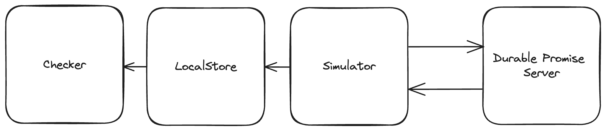

# Durable Promise Test Harness 

This test harness is a verification system that checks implementations for conformance to the [Durable Promise Specification](https://github.com/resonatehq/durable-promise). 

## Architecture

<p align="center">
    
</p>

The test harness is composed of four key components working together: 

- Checker 
- LocalStore 
- Simulator 
- Durable Promise Server 

### Checker 

The `Checker` validates that the operation history follows the specifications of the [Durable Promise API](https://github.com/resonatehq/durable-promise). It is the final validation step.

### LocalStore 

The `LocalStore` tracks the start and end of each operation in memory. It generates the history of events that the `Checker` uses to verify correctness.

### Simulator 

The `Simulator` generates a simulated client and pseudo-random sequence of operations for testing purposes. It exercises the system under diverse conditions.

### Durable Promise Server

The `Durable Promise Server` implements the core [Durable Promise Specification](https://github.com/resonatehq/durable-promise). It is the system under test. 

## Usage 

This project contains a full test suite using go:
```bash
DP_SERVER=http://0.0.0.0:8001/ go test -v -timeout 45m ./test/...  
```

NOTE: the history, analysis, and any supplementary results are written to the filesystem under `test/results/<test-name>/<date>` for later review.

## Contributions

We welcome bug reports, feature requests, and pull requests!

Before submitting a PR, please make sure:

- New tests are included
- All tests are passing
- Code is properly formatted
- Documentation is updated

