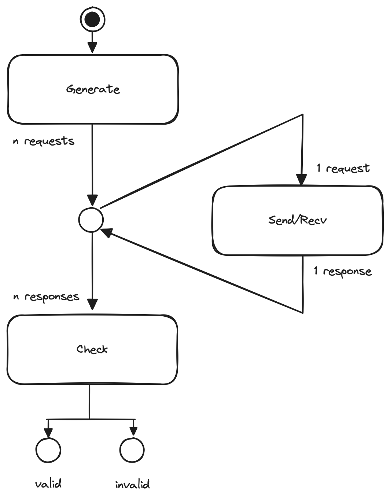

# Durable Promise Test Harness 

This test harness is a verification system that checks implementations for conformance to the [Durable Promise Specification](https://github.com/resonatehq/durable-promise). 

## Architecture

<p align="center">
    
</p>

The test harness is composed of four key components working together: 

- Checker 
- LocalStore 
- Simulator 
- Durable Promise Server 

### Checker 

The `Checker` validates that the operation history follows the specifications of the [Durable Promise API](https://github.com/resonatehq/durable-promise). It is the final validation step.

### LocalStore 

The `LocalStore` tracks the start and end of each operation in memory. It generates the history of events that the `Checker` uses to verify correctness.

### Simulator 

The `Simulator` generates a simulated client and pseudo-random sequence of operations for testing purposes. It exercises the system under diverse conditions.

### Durable Promise Server

The `Durable Promise Server` implements the core [Durable Promise Specification](https://github.com/resonatehq/durable-promise). It is the system under test. 

## Usage 

## Getting Started

1. **Build**

  X

  ```bash
  go build -o harness
  ```

2. **Run linearizability tests**

  X 

  ```bash
  ./harness linearize -a http://0.0.0.0:8001/ -r 1000 -c 3
  ```

3. **Run load tests**

  X 
  
  ```bash
  ./harness load -a http://0.0.0.0:8001/ -r 1000
  ```

NOTE: the history, analysis, and any supplementary results are written to the filesystem under `test/results/<test-name>/<date>` for later review.

## Design Decisions 

### Event Loop 

generate everything in batch, execute one by one, check everything in batch

The test harness' event loop waits generates, the loop dispatches the entire queue of operations 
to the appropriate client to be processed. 


The harness's event loop keeps running as long as their are new events to process are an invalid 
event has occurred: 
- The loop checks for new events, like a call to the promise api. 
- When an event is found, the loop dispatches it to the model to take step. 
- The loop continues running and keeps checking for new events. 


Some common event loops: 
- Node.js event loop - Waits for events like incoming HTTP requests, filesystem events, timed events etc and send them to callback functions. 

In this repo the event loop: 

<p align="center">
    
</p>

### Requests (Table) 

### Clocks 

## Contributions

We welcome bug reports, feature requests, and pull requests!

Before submitting a PR, please make sure:

- New tests are included
- All tests are passing
- Code is properly formatted
- Documentation is updated

